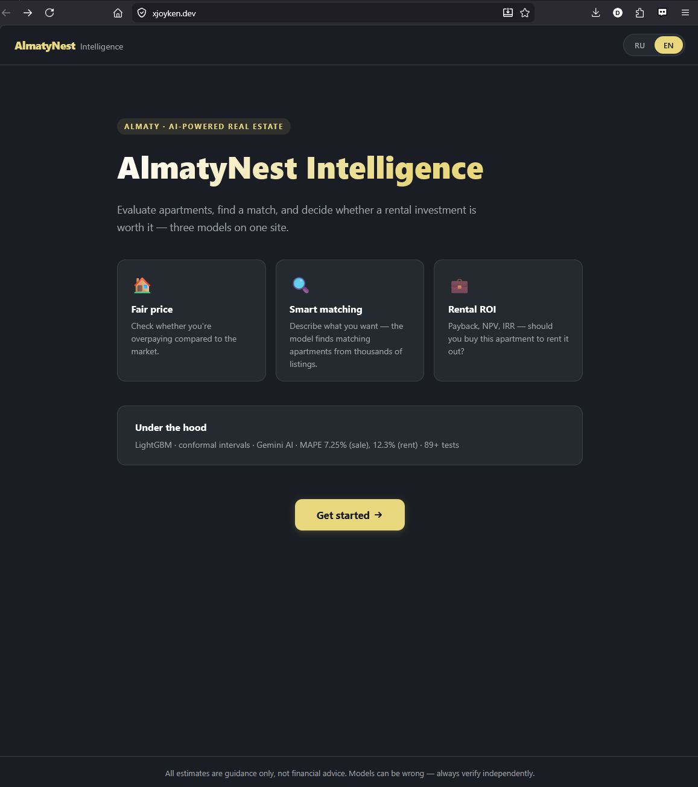
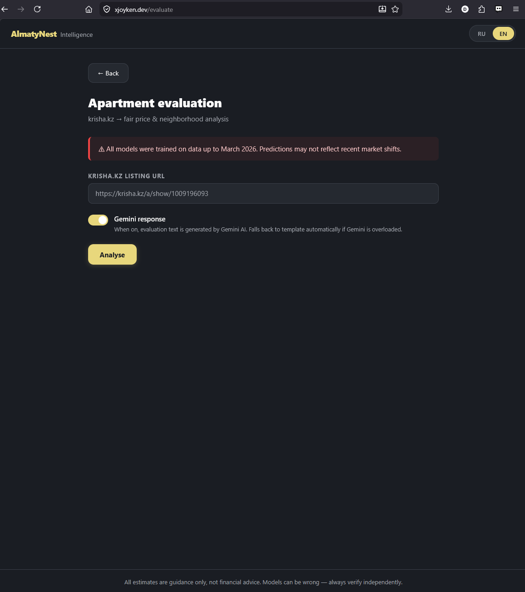
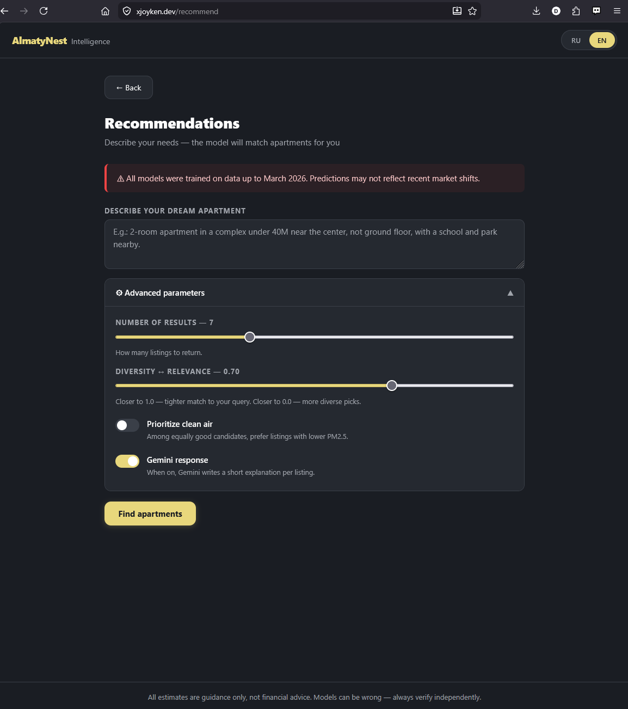
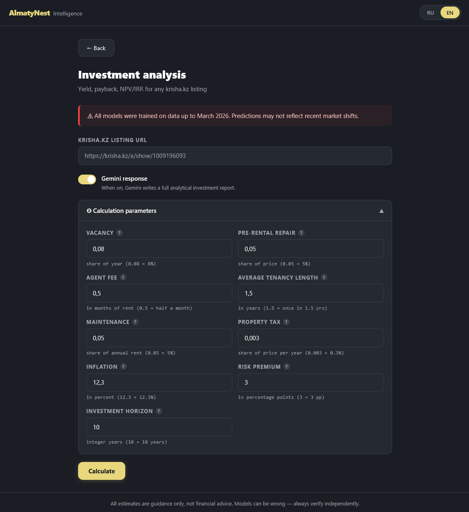
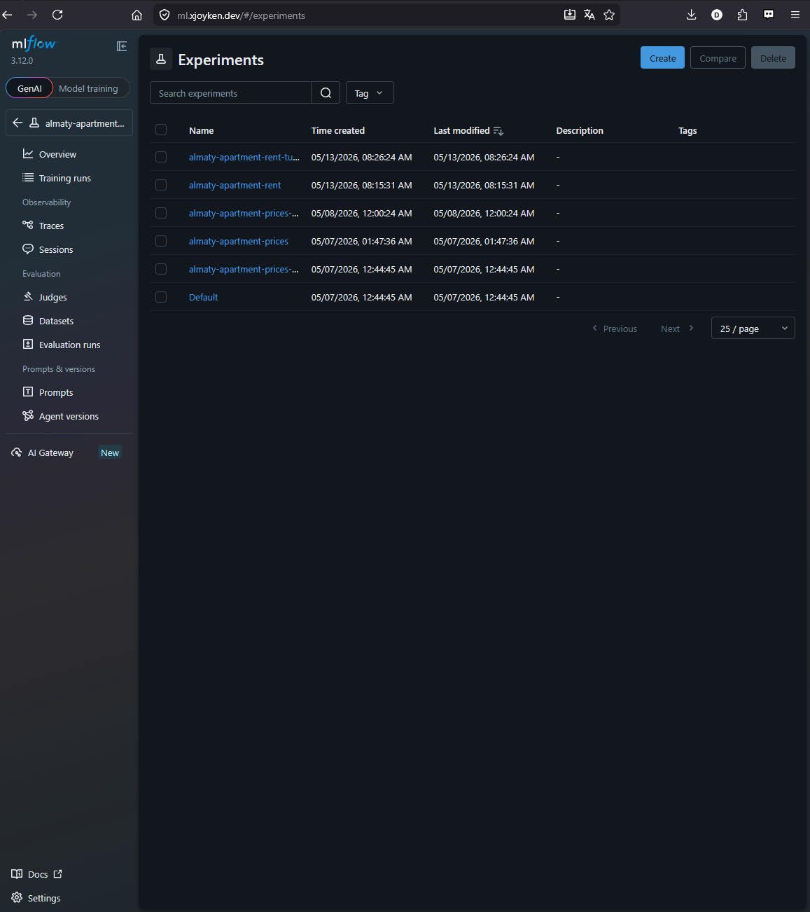

# AlmatyNest Intelligence 🏘️✨

**AlmatyNest Intelligence** is an end-to-end, AI-powered real-estate platform tailored to the **Almaty** market.
It combines classical gradient boosting (LightGBM / CatBoost / XGBoost) with a Large Language Model (Google Gemini) to turn raw `krisha.kz` listings into actionable financial insights:

- *Is this listing a Great Deal, Fair, or Overpriced?* — conformal-calibrated answer with a 90% prediction interval.
- *"Find me a 2-room apartment in Almaly under 35M near a metro"* — semantic search over 38k+ listings with KNN + MMR re-ranking.
- *Should I buy this apartment to rent it out?* — full cash-flow model (NPV / IRR / payback) using both sale-price and rent-price predictions.

<p align="center">
  
  <br/><em>Landing page — three core flows: Fair Price, Semantic Search, Investment Calculator.</em>
</p>

> **📸 Suggested visuals to add (placeholders below).**
> 1. **Hero screenshot** of the landing page (`/`) — clean, sets the brand.
> 2. **Animated GIF** of the semantic-search flow (`/recommend`) — typing a natural-language query, Gemini parsing chips appearing, top-5 cards fading in. This is the most impressive flow to show in motion.
> 3. **Screenshot** of an evaluated listing (`/evaluate`) — verdict badge ("Great Deal" / "Fair" / "Overpriced") with the 90% confidence interval bar.
> 4. **Screenshot** of the investment dashboard (`/investment`) — KPI tiles for NPV / IRR / Payback + the Optimistic / Base / Conservative scenario toggle.
> 5. **Screenshot** of the MLflow UI showing experiments side-by-side.

---

## 🌟 Key Features

### 1. Fair Price Evaluation — `/evaluate`
Paste any `krisha.kz` listing URL. The backend scrapes the listing, builds the full POI / macro feature vector, runs the LightGBM sale model, and returns:
- A **point prediction** of fair price.
- A **conformal 90% prediction interval** — calibrated on a held-out split.
- A **verdict** (Great Deal / Fair Price / Overpriced) based on where the asking price falls inside that interval.
- A **natural-language explanation** generated by Gemini (top SHAP-style feature contributions translated to plain language).

<p align="center">
  
  <br/><em>Fair price evaluation demo — Evaluation.</em>
</p>

### 2. Semantic AI Search — `/recommend`
Free-form natural-language search over the indexed listings.
- **Gemini** extracts numeric targets (rooms, max price, district) and soft preferences ("near a park", "not first floor", "fresh renovation").
- Hard constraints filter the candidate pool; soft constraints score it.
- **K-Nearest Neighbors + Maximal Marginal Relevance (MMR, λ = 0.7)** picks a diverse top-5 (or top-K up to 20) that doesn't return five clones of the same building.
- Each result ships with a short Gemini-written reason ("matches your park / metro preference, 3 min walk to Atakent").

<p align="center">
  
  <br/><em>Semantic search demo — Recommendations.</em>
</p>

### 3. Buy-to-Let Investment Calculator — `/investment`
Predicts **sale price** AND **monthly rent** for the same listing, then runs a full discounted-cash-flow model.
- Configurable economics: vacancy %, repair %, agent commission, tenant turnover, maintenance, property tax, inflation, risk premium, horizon.
- KPIs: **Gross Yield**, **Net Yield**, **Payback (nominal & inflation-adjusted)**, **NPV**, **IRR**.
- **Stress-test scenarios** auto-generated from the rent model's conformal interval — "Optimistic" (upper rent bound) and "Conservative" (lower rent bound) give an honest envelope, not just one number.

<p align="center">
  
  <br/><em>Investment dashboard demo — Investment Calculator.</em>
</p>

---

## 🚀 Live Demo

| Service | URL |
|---|---|
| 🌐 **Frontend** | [https://xjoyken.dev](https://xjoyken.dev) |
| ⚙️ **FastAPI Backend (Swagger)** | [https://api.xjoyken.dev/docs](https://api.xjoyken.dev/docs) |
| 📊 **MLflow Tracking** | [https://ml.xjoyken.dev](https://ml.xjoyken.dev) |

All three are served through a single Cloudflare Tunnel from a containerised stack — no public ports exposed.

**Where to click to test each feature:**
- Land on [xjoyken.dev](https://xjoyken.dev) → "Get Started" → pick one of the three cards on `/select`.
- Fair Price: paste any URL from `krisha.kz/a/show/<id>` on `/evaluate`.
- Semantic Search: type a Russian or English language query on `/recommend`.
- Investment: paste a URL on `/investment`, tweak the sliders, see KPIs update.

---

## 🧠 Models, Metrics & Configurations

All models are trained with strict **nested cross-validation (5 outer × 3 inner folds)** to get a true generalisation estimate — no train/test leakage from hyperparameter selection.

### Model 1 — Sale Price (`almaty-apartment-prices`)
- **Algorithm:** LightGBM Regressor
- **Best config:** [`src/configs/lightgbm_best.json`](src/configs/lightgbm_best.json) or [`src/configs/lightgbm_nested_best.json`](src/configs/lightgbm_nested_best.json)
- **Calibrated on:** ~38,762 processed listings (POI + air quality + crime + macro features)

| Metric | Holdout | Nested 5×3 CV (mean ± std) |
|---|---|---|
| **R²** | 0.9519 | **0.9470 ± 0.0093** |
| **MAPE** | 7.11% | **7.42% ± 0.02%** |
| **MAE** | ~4.61M ₸ | **4,859,485 ± 96,922 ₸** |
| **RMSE** | ~11.11M ₸| **11,938,614 ± 1,131,041 ₸** |

> 95% of price variance explained; on average we're within ~7% of the listed market price.

### Model 2 — Rent Price (`almaty-apartment-rent`)
- **Algorithm:** LightGBM Regressor
- **Best config:** [`src/configs/lightgbm_rent_nested_best.json`](src/configs/lightgbm_rent_nested_best.json)

| Metric | Holdout | Nested 5×5 CV (mean ± std) |
|---|---|---|
| **R²** | 0.8695 | **0.8664 ± 0.0182** |
| **MAPE** | 12.31% | **12.26% ± 0.29%** |
| **MAE** | ~49,139 ₸ | **48,354 ± 2,011 ₸** |
| **RMSE** | ~101,358 ₸| **101,750 ± 8,166 ₸** |

### Recommender — Precision@K
25 hand-curated query/relevance pairs in [`metrics/eval_queries.json`](metrics/eval_queries.json).
Each query is run through the full stack (Gemini extraction → hard filter → scoring → MMR).

| K | Mean Precision | Median Precision | Hit Rate |
|---|---|---|---|
| 5 | **0.664** | 1.00 | **0.80** |
| 10 | (see [`metrics/recommender_precision.json`](metrics/recommender_precision.json)) | | |

### Investment Module — Dataset-wide Distribution
Every listing scored under production defaults (vacancy 8%, repair 5%, agent 0.5 mo, turnover 1.5 yr, maintenance 5%, tax 0.3%, inflation 12.3%, risk premium 3pp, horizon 10 yr):

| Metric | Median | p25 / p75 |
|---|---|---|
| Gross yield | **7.25%** | 6.31% / 8.20% |
| Net yield | **6.38%** | 5.52% / 7.26% |
| Payback (nominal) | **15.7 yr** | 13.8 / 18.1 |
| Payback (real, inflation-adj.) | **15.4 yr** | 13.8 / 17.4 |

Full distributions + risk-premium sensitivity sweep in [`metrics/investment_roi.json`](metrics/investment_roi.json).

### Alternative model configs available
Random-search tuned baselines live in [`src/configs/`](src/configs/) — swap with `--params`:
- [`catboost_best.json`](src/configs/catboost_best.json) — CatBoost head-to-head
- [`xgboost_best.json`](src/configs/xgboost_best.json) — XGBoost head-to-head
- [`lightgbm_best.json`](src/configs/lightgbm_best.json) — LightGBM (sale, production)
- [`lightgbm_rent_nested_best.json`](src/configs/lightgbm_rent_nested_best.json) — LightGBM (rent, production)

<p align="center">
  
  <br/><em>MLflow experiments dashboard</em>
</p>

---

## 🏗️ Architecture & Tech Stack

```
┌─────────────────┐    HTTPS    ┌───────────────────┐    POI / macro    ┌──────────────┐
│  Next.js (UI)   │ ──────────► │  FastAPI Backend  │ ────────────────► │ Feature Bldr │
│  xjoyken.dev    │             │   api.xjoyken.dev │                   │ (POI + Air + │
└─────────────────┘             └────────┬──────────┘                   │  Crime+Macro)│
                                         │                              └──────┬───────┘
                                         │  load model URI                     │
                                         ▼                                     ▼
                                ┌───────────────────┐               ┌──────────────────┐
                                │   MLflow Server   │ ◄──── logs ───│ LightGBM Models  │
                                │   ml.xjoyken.dev  │               │  (sale + rent)   │
                                └───────────────────┘               └──────────────────┘
                                         ▲
                                         │ Gemini SDK (JSON-structured outputs)
                                ┌────────┴──────────┐
                                │  Google Gemini    │
                                │      2.5 Flash    │
                                └───────────────────┘
```

- **Frontend:** Next.js 15 (App Router), TypeScript, Tailwind CSS, Framer Motion
- **Backend:** FastAPI, Python 3.11, Pydantic, Pandas, NumPy, Scikit-Learn, LightGBM / CatBoost / XGBoost
- **LLM:** Google Gemini 2.5 Flash (official SDK, JSON-structured outputs, prompt-engineered extraction)
- **MLOps:** MLflow (experiment tracking, model registry, artifact store, SQLite backend)
- **Deployment:** Docker Compose + Cloudflare Tunnels (Zero Trust, no exposed ports)

---

## 🛠️ Local Setup

### Prerequisites
- Docker & Docker Compose
- Python 3.11+
- `.env` file (copy from [`.env.example`](.env.example)) — needs `GEMINI_API_KEY` at minimum.

### Run the full stack (development)
Hot reload for the backend, frontend on `:3000`, backend on `:8000`, MLflow on `:5000`:
```bash
docker compose -f docker-compose.yml -f docker-compose.dev.yml up -d --build
```

### Run the full stack (production)
Strictly behind the Cloudflare Tunnel — no exposed ports:
```bash
docker compose build
docker compose up -d
```

### Bare-metal Python (training, notebooks)
```bash
python -m venv venv
# Windows
venv\Scripts\activate
# Unix
source venv/bin/activate

pip install -r requirements.txt
```

---

## 🧪 The Pipeline — One-Stop Command Reference

> Every pipeline step is exposed through a single entry point: **`python src/almaty_price_baseline.py <command>`**.
> All commands log to MLflow automatically (experiment names: `almaty-apartment-prices` for sale, `almaty-apartment-rent` for rent).

### Train

```bash
# Sale-price model — defaults: LightGBM, test_size=0.2, seed=42
python src/almaty_price_baseline.py train

# Production sale-price training — load best LightGBM hyperparameters + two-pass refit
python src/almaty_price_baseline.py train --model lightgbm --params src/configs/lightgbm_best.json --final

# Pick a different algorithm
python src/almaty_price_baseline.py train --model catboost --params src/configs/catboost_best.json --final
python src/almaty_price_baseline.py train --model xgboost  --params src/configs/xgboost_best.json  --final

# Inline JSON hyperparameters instead of a file
python src/almaty_price_baseline.py train --model lightgbm \
  --params '{"n_estimators":2500,"learning_rate":0.03,"num_leaves":255}'

# Production rent-price training
python src/almaty_price_baseline.py train-rent --model lightgbm --params src/configs/lightgbm_rent_nested_best.json --final
```

> `--final` enables the two-pass mode: early-stopping finds the best iteration on a validation split, then the model is refit on the **full** train set without ES — that's what gets logged to MLflow as the production artefact.

### Evaluate (holdout only — no MLflow write)

```bash
python src/almaty_price_baseline.py evaluate      --model lightgbm --params src/configs/lightgbm_best.json --final
python src/almaty_price_baseline.py evaluate-rent --model lightgbm --params src/configs/lightgbm_rent_nested_best.json --final
```

### Hyperparameter Tuning

```bash
# Random search (sale)
python src/almaty_price_baseline.py tune --model lightgbm --mode random --trials 50

# Nested 5×5 CV (sale) — the proper way to estimate generalisation
python src/almaty_price_baseline.py tune --model lightgbm --mode nested --trials 50 --outer-splits 5 --inner-splits 5

# Nested CV — rent model (this is exactly how the production rent config was tuned)
python src/almaty_price_baseline.py tune-rent --model lightgbm --mode nested --trials 50 --outer-splits 5 --inner-splits 5

# Other algorithms
python src/almaty_price_baseline.py tune --model catboost --mode nested --trials 50 --outer-splits 5 --inner-splits 5
python src/almaty_price_baseline.py tune --model xgboost  --mode nested --trials 50 --outer-splits 5 --inner-splits 5
```

### Predict (single listing)

```bash
# By krisha.kz listing ID (parsed live)
python src/almaty_price_baseline.py predict --listing-id 1004822743

# By inline / file JSON payload
python src/almaty_price_baseline.py predict --input-json payload.json

# By CSV row
python src/almaty_price_baseline.py predict --input-csv listing.csv

# Skip retraining — pull the latest matching model straight from MLflow
python src/almaty_price_baseline.py predict --listing-id 1004822743 --from-mlflow \
  --experiment-name almaty-apartment-prices
```

### Evaluate the Recommender (Precision@K)

```bash
python src/almaty_price_baseline.py eval-recommender \
  --queries metrics/eval_queries.json \
  --output  metrics/recommender_precision.json \
  --k 5 10
```

### Evaluate the Investment Module (dataset-wide ROI)

```bash
python src/almaty_price_baseline.py eval-investment --output metrics/investment_roi.json
```

### MLflow Tracking Server (local)

```bash
mlflow server \
  --backend-store-uri sqlite:///mlflow.db \
  --default-artifact-root ./mlruns \
  --host 0.0.0.0 --port 5000
# → open http://localhost:5000
```

### Pulling models from MLflow into the API
The FastAPI service loads the **latest** model for the configured experiment (`almaty-apartment-prices`, `almaty-apartment-rent`) at boot. After training a new winning run:
```bash
docker compose restart backend
```

### Tests

```bash
pytest
```

---

## 📒 Notebooks

Exploratory work and visual diagnostics live in [`notebooks/`](notebooks/):

| Notebook | What's inside |
|---|---|
| [`EDA.ipynb`](notebooks/EDA.ipynb) | Initial exploratory analysis — distributions, missingness, outliers. |
| [`feature_analysis.ipynb`](notebooks/feature_analysis.ipynb) | Feature engineering audits and SHAP-style importance per group. |
| [`geo_price_overview.ipynb`](notebooks/geo_price_overview.ipynb) | District-level and lat/lon-binned price heatmaps over Almaty. |
| [`poi_impact.ipynb`](notebooks/poi_impact.ipynb) | Marginal effect of each POI category (metro, schools, parks, …) on price. |
| [`metrics_dashboard.ipynb`](notebooks/metrics_dashboard.ipynb) | Reads JSON snapshots from `metrics/` and renders the headline tables / plots used in this README. |

---

## 📂 Repository Layout

```
ML-Project/
├── src/
│   ├── ml_project/             # Core ML package
│   │   ├── cli.py              # Single entry point for every pipeline command
│   │   ├── train.py            # Sale-price training (with ES, two-pass refit)
│   │   ├── tune.py             # Random + Nested CV hyperparameter search
│   │   ├── predict.py          # Inference + conformal intervals + verdict logic
│   │   ├── evaluation.py       # Metrics: MAE / MAPE / RMSE / R² / coverage
│   │   ├── calibration.py      # Conformal prediction interval calibration
│   │   ├── features.py         # Listing-level feature builder
│   │   ├── poi.py, air.py, crime.py, macro.py   # External feature joins
│   │   ├── tracking.py         # MLflow wiring
│   │   ├── recommender/        # KNN + MMR semantic search
│   │   ├── rent/               # Mirror pipeline for the rent model
│   │   └── evals/              # Offline eval for recommender + investment
│   ├── backend/                # FastAPI app (krisha scraper + endpoints)
│   ├── configs/                # Best hyperparameters per algorithm
│   └── tests/                  # Pytest suite
├── frontend_next-1/            # Next.js 15 app
├── notebooks/                  # EDA + diagnostics
├── datasets/                   # Raw + processed CSVs (POIs, ads, macro, …)
├── models/                     # Serialised production models
├── metrics/                    # Reproducible evaluation snapshots (JSON)
├── mlruns/, mlflow.db          # MLflow artifact store + SQLite backend
├── Dockerfile, Dockerfile.mlflow
├── docker-compose.yml          # Production stack
└── docker-compose.dev.yml      # Dev overrides (exposed ports, hot reload)
```

---

## 🔌 Backend API (selected endpoints)

Full schema at [`/docs`](https://api.xjoyken.dev/docs).

| Method | Endpoint | Purpose |
|---|---|---|
| `GET`  | `/health` | Liveness probe. |
| `POST` | `/apartments/evaluate` | Parse a krisha.kz URL → predict fair price + verdict + explanation. |
| `POST` | `/apartments/investment` | Same listing → full DCF investment KPIs + scenarios. |
| `POST` | `/recommendations/features` | LLM-only step: extract structured features from a free-form prompt. |
| `POST` | `/recommendations` | Full semantic search pipeline (LLM extraction → KNN → MMR → narrative). |

---

## 🧰 Logs & Maintenance

```bash
docker logs ml-backend  -f      # FastAPI
docker logs ml-frontend -f      # Next.js
docker logs ml-mlflow   -f      # MLflow tracking
docker logs ml-tunnel   -f      # Cloudflare tunnel
```

To roll a freshly trained model into production:
1. Train it (`python -m ml_project.cli train --final --params ...`).
2. Confirm the run on MLflow UI.
3. `docker compose restart backend`.